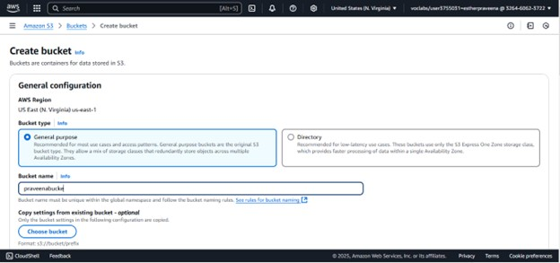
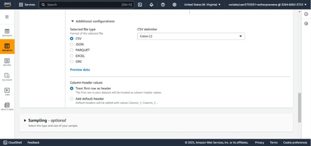
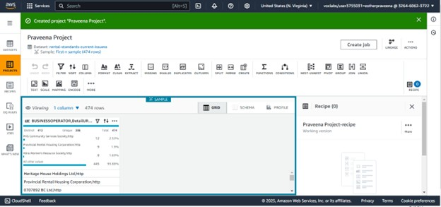

### 📥 Data Ingestion Step (via AWS S3)

- The original dataset `rental-standards-current-issues.csv` was uploaded to an S3 bucket.
- File format: CSV (semicolon-delimited)
- This ingestion step allowed downstream profiling and cleaning using AWS Glue DataBrew.

# ☁️ AWS Glue DataBrew: Data Wrangling Workflow

## 🎯 Objective

To demonstrate a **low-code data wrangling** workflow using **AWS Glue DataBrew** on the rental standards dataset from the City of Vancouver.

---

## 📊 Dataset Overview

- 📁 File: `rental-standards-current-issues.csv`
- 📦 Source: [City of Vancouver Open Data Portal](https://opendata.vancouver.ca/explore/dataset/rental-standards-current-issues)
- 🧭 Focus: Clean-up of missing values, data types, and location fields (`geo_point_2d`)

---

## 🧰 Tools Used

| Type       | Tool / Service     |
|------------|--------------------|
| Storage    | Amazon S3          |
| Wrangling  | AWS Glue DataBrew  |
| Profiling  | DataBrew Profile Jobs |
| Notebook (for comparison) | Google Colab (`data_cleaning.ipynb`) |

---

## 🔄 Steps in AWS DataBrew

### 1. 🔹 Dataset Upload

- Uploaded `rental-standards-current-issues.csv` to an S3 bucket
- File was semicolon `;` separated and needed parsing
- To have a visualization of our data summary, I created an AWS Glue DataBrew project and named it "Praveena Project” and the recipe named "Praveena Project-recipe”. I then connected this new project to the raw data I previously uploaded and stored in an Amazon S3 bucket. praveendata
- To connect my initially uploaded data, I chose to connect to new data, and then the option to search and select my initial data came up, so I chose our raw data uploaded earlier:
I have also given permission: role name as LabRole.
My data type is in Excel CSV format.
My data nature is separated by the delimiter “;”, so I chose it to help create columns in transforming my data to columns.
I am also treating my first row as a header.
Here is a snapshot of my data transformation parameters while creating the project

After creating our project (Praveena Project) and connecting it to our raw data, the figure below shows the screen of our project data:
- 

---

### 2. 🧪 Data Profiling Job

- Created **Profile Job** in DataBrew to auto-detect:
  - Missing values
  - Null % per column
  - Data types
  - Unique values per column
    Here are the screenshots for stepwise process

---

### 3. 🧹 Data Cleaning via Recipes

| Task | Action |
|------|--------|
| Remove nulls | Dropped rows with missing `geo_point_2d` |
| Rename columns | For readability: `BUSINESSOPERATOR → Business_Operator` |
| String cleanup | Trimmed whitespaces from column names |
| Column split | Used string split on `geo_point_2d` to extract Latitude & Longitude |

We have a new transformed data; we can now use this data moving forward. At this stage, I create a new project because I do not want to interfere with our original project and its dataset.
I therefore create a new project “Praveena Project 2”, using the newly created dataset “praveen3data”. In the project, I also created a new recipe for cleaning our data from the issues identified in the previous step, named it “Praveena Project 2-recipe.”

---

### 4. ✅ Output

- Exported cleaned dataset to **S3 output folder**
- Final format: CSV with clean headers and location split into `Latitude` and `Longitude`

---

## 🗂️ Files Related

- [`aws/databrew_workflow.md`](databrew_workflow.md)
- [`data_cleaning.ipynb`](../notebooks/data_cleaning.ipynb)
- [`rental-standards-current-issues.csv`](../data/rental-standards-current-issues.csv)

---

## 🧠 Reflection

AWS Glue DataBrew provided a powerful visual, low-code platform to:
- Automate profiling
- Generate reusable cleaning steps (recipes)
- Speed up initial wrangling for analysis

---

